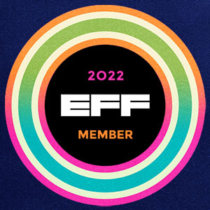

### Hey 👋

I'm currently developing web applications and command line tools in Python, TypeScript, and Rust.

My favourite web frameworks are [Flask](https://github.com/pallets/flask) for Python and [Mithril](https://github.com/MithrilJS/mithril.js) for TypeScript.

Recently, I built a [CLI tool for data integrity](https://github.com/coffeacloudberry/integral-drive), a [blog from scratch](https://github.com/coffeacloudberry/galleria), and a [GPS data interchange format](https://github.com/coffeacloudberry/WebTrackCLI).

This is me: https://keyoxide.org/hkp/FFD0B3DDAD69CB71BAE13B1DDFFF34860D361C52

